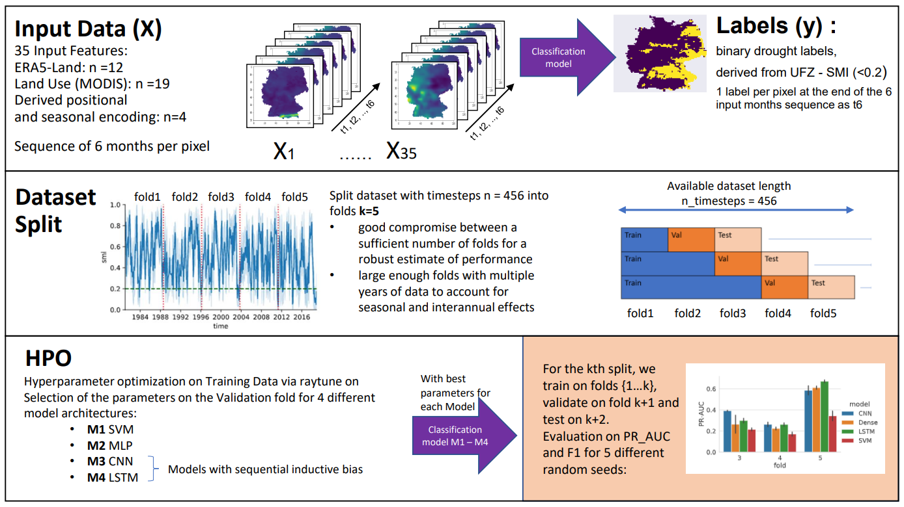

[](https://opensource.org/licenses/MIT)
[](https://arxiv.org/abs/2111.15452)


# Drought detection in climate data

This repository contains the source code for the following paper. If you find this repository useful in your research, please consider adding the following citation:


```bibtex
@article{gottfriedsen2021generalization,
  title={On the Generalization of Agricultural Drought Classification from Climate Data},
  author={Gottfriedsen, Julia and Berrendorf, Max and Gentine, Pierre and Reichstein, Markus and Weigel, Katja and Hassler, Birgit and Eyring, Veronika},
  journal={arXiv preprint arXiv:2111.15452},
  year={2021}
}
```


## Abstract
Climate change is expected to increase the likelihood of drought events, with severe implications for food security.
Unlike other natural disasters, droughts have a slow onset and depend on various external factors, making drought detection in climate data difficult. 
In contrast to existing works that rely on simple relative drought indices as ground-truth data, we build upon soil moisture index (SMI) obtained from a hydrological model.
This index is directly related to insufficiently available water to vegetation.
Given ERA5-Land climate input data of six months with landuse information from MODIS satellite observation, we compare different models with and without sequential inductive bias in classifying droughts based on SMI.
We use PR-AUC as the evaluation measure to account for the class imbalance and obtain promising results despite a challenging time-based split.
We further show in an ablation study that the models retain their predictive capabilities given input data of coarser resolutions, as frequently encountered in climate models.


## Overview

<p align="center"></p>


## Data

Monthly mean data from 1981 - 2020, limited by the ERA5 Land and SMI data availability.

1) Ground Truth Labels 
    - Germany, [UFZ monthly drought data, topsoil Soil moisture index](https://www.ufz.de/index.php?de=37937)

2) Input data:
    - Germany, ERA5 Land monthly, available [cds](https://cds.climate.copernicus.eu/cdsapp#!/dataset/reanalysis-era5-single-levels-monthly-means?tab=overview)
    - MODIS landcover data, available via [cds](https://cds.climate.copernicus.eu/cdsapp#!/dataset/satellite-land-cover?tab=overview)


---
## Usage

Install package in drought_prediction folder:
```shell script
pip install -e .
```

Usage of the drought module:
```shell script
Usage: drought [OPTIONS] COMMAND [ARGS]...

  The main entry point.

Options:
  --help  Show this message and exit.

Commands:
  preprocess  Data preprocessing.
  train       Train a single model.
  tune        Run hyperparameter optimization.
```


## Examples

### Download ERA5 Land variables. 
Timerange:  from 1981 to 2020. <br>
If no output-path, Path: "drought" /  "raw" /  "era5" will be created.<br>
You need to have cds credentials as a .cdsapric file on your machine under home/user.

```shell script
drought preprocess era5 
--start-year 1981 
--end-year 2020 
```

*---insert dataset example image ---* 


### Train a single sklearn model. 
The dataset is expected to be named 'training_dataset.nc'
```shell script
drought train sklearn  
--model LinearSVC
--data-root %root-directory-containing-netcdf-training-file%
```

### Run Hyperparameter Optimisation with raytune on a keras model.


```shell script
drought tune keras
--model "lstm"
--num-folds 5
--data-root %root-directory-containing-netcdf-training-file%
```

---

## Authors
Julia Gottfriedsen <br>
Max Berrendorf (@[mberr](https://github.com/mberr))


